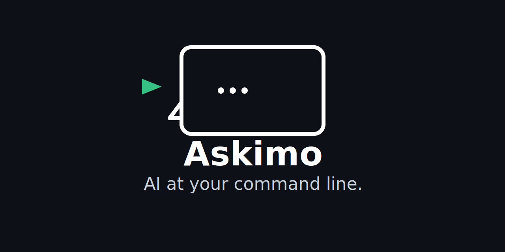

<p align="center">
  <picture>
    <source media="(prefers-color-scheme: dark)" srcset="public/askimo-logo.svg">
    
  </picture>
</p>

<p align="center">
  <b><a href="https://askimo.chat">askimo.chat</a></b> · AI Desktop + CLI toolkit that works with ANY model.
</p>

<p align="center">
  <a href="https://github.com/haiphucnguyen/askimo/actions/workflows/cli-release.yml">
    
  </a>
  <a href="https://github.com/haiphucnguyen/askimo/actions/workflows/desktop-release.yml">
    
  </a>
  <a href="./LICENSE">
    
  </a>
  <a href="https://github.com/haiphucnguyen/askimo/releases">
    
  </a>
  <a href="./CONTRIBUTING.md#-enforcing-dco">
    
  </a>
</p>

<p align="center">
  <a href="https://github.com/haiphucnguyen/askimo/stargazers">
    
  </a>
  
  
  
  
  
</p>

<p align="center">
  
  
  
  
  
  
  
</p>

---

**[Why Askimo?](#why-askimo)** · **[Supported Providers](#supported-providers)** · **[Quick Start](#-quick-start)** · **[Comparisons](#askimo-vs-other-ai-clients)**

---

# Why Askimo?

**Stop switching between multiple AI apps. Stop vendor lock-in. Stop sacrificing privacy.**

Askimo is a provider-agnostic AI toolkit that gives developers, writers, and researchers complete control over their AI workflow - whether you're chatting with Claude 3.5 Sonnet, automating with GPT-4o, or running local models with Ollama.

### 🚀 Key Benefits

* **🎯 One Interface, Every AI Provider** - Switch between OpenAI, Claude, Gemini, X AI, Ollama, and local models instantly
* **⚡ CLI for Power Users** - Pipe logs, automate workflows, and integrate AI into your dev pipeline
* **🔒 Privacy-First Architecture** - All chat history stored locally on your machine, not in the cloud
* **📦 No Vendor Lock-In** - Works with any OpenAI-compatible API endpoint
* **🎨 Custom Directives & Prompts** - Build reusable prompt libraries and automation recipes
* **💾 Smart History & Search** - Never lose an important conversation - search, star, and export everything

### 📦 Two Products, One Philosophy

**Askimo Desktop** - Beautiful native chat interface for interactive AI conversations  
**Askimo CLI** - Terminal-first automation tool for scripts, pipelines, and batch processing


## Supported Providers
### Cloud

* OpenAI

* Anthropic Claude

* Google Gemini

* X AI (Grok)

### Local

* Ollama

* LM Studio

* LocalAI

* Docker AI

Askimo works with any OpenAI-compatible API endpoint.

## 🚀 Quick Start

### Desktop
Download the installer for your operating system:

- **macOS**: [Download .dmg](https://github.com/haiphucnguyen/askimo/releases/latest/download/Askimo-Desktop-macos.dmg)
- **Windows**: [Download .msi](https://github.com/haiphucnguyen/askimo/releases/latest/download/Askimo-Desktop-windows.msi)
- **Linux**: [Download .deb](https://github.com/haiphucnguyen/askimo/releases/latest/download/Askimo-Desktop-linux.deb)

Or visit the [releases page](https://github.com/haiphucnguyen/askimo/releases) for all available versions.

### CLI

**Recommended (macOS/Linux):**
```bash
curl -sSL https://raw.githubusercontent.com/haiphucnguyen/askimo/main/tools/installation/install.sh | bash
```

**Recommended (Windows - PowerShell):**
```powershell
iwr -useb https://raw.githubusercontent.com/haiphucnguyen/askimo/main/tools/installation/install.ps1 | iex
```

For alternative installation methods (Homebrew, Scoop, Manual Download), visit the [installation guide](https://askimo.chat/docs/cli/installation/).

**First-time setup:** Visit the [getting started guide](https://askimo.chat/docs/cli/getting-started/) to configure your AI providers and models.

**Quick Start:**
```bash
# Verify installation
askimo --version

# Start chatting
askimo -p "Hello, AI!"
```

---

## Askimo vs Other AI Clients

**Why choose Askimo?** Most AI tools lock you into one provider or lack automation capabilities. Askimo gives you both a beautiful desktop experience AND powerful CLI automation - with complete freedom to switch providers.

| Feature | **Askimo** | **LM Studio** | **Ollama Desktop GUIs** | **ChatGPT Desktop** |
|--------|-------------|----------------|--------------------------|----------------------|
| Works with multiple providers | ✅ | ❌ (Local only) | ❌ (Local only) | ❌ (OpenAI only) |
| Works with local models | ✅ | ✅ | ✅ | ❌ |
| Works with cloud models (OpenAI, Claude, Gemini, etc.) | ✅ | ❌ | ❌ | ✅ |
| Desktop application | ✅ | ✅ | ✅ | ✅ |
| Command-line interface (CLI) | ✅ | ✅ (API server) | ✅ (CLI only) | ❌ |
| Automation / scripting support | ✅ | ✅ (via API) | ✅ (via CLI) | ❌ |
| RAG (Retrieval-Augmented Generation) | ✅ Desktop (Single folder) | ❌ | ❌ | ✅ (File upload) |
| Searchable chat history | ✅ | ✅ | Varies | ✅ |
| Star/favorite conversations | ✅ | ❌ | ❌ | ✅ (Pinned) |
| Custom directives / prompt profiles | ✅ | ✅ (System prompt) | ❌ | ✅ (Custom instructions) |
| Export conversations | ✅ | ❌ | ❌ | ✅ |
| Privacy (local storage) | ✅ | ✅ | ✅ | ❌ (Cloud sync) |
| Multi-workspace organization | ✅ (Projects) | ❌ | ❌ | ✅ (Projects + Memory) |
| Works offline (local models) | ✅ | ✅ | ✅ | ❌ |


## 🛠️ Choose Your Tool

### Askimo Desktop

**Who it's for:** Developers, writers, researchers, and anyone who needs fast, reliable AI assistance without switching apps.

**Think of it as:** Your personal AI workbench - one app to rule all AI providers.

[](https://askimo.chat/desktop)

A native desktop application that brings all your AI conversations into one beautiful, searchable interface with complete privacy and control.

#### 🎯 Key Features
- **Multi-Provider Support** - Switch between OpenAI, Claude, Gemini, X AI, and Ollama without leaving the app
- **100% Local Storage** - All chat history stored on your machine, never in the cloud
- **RAG (Retrieval-Augmented Generation)** - Connect a knowledge folder to give AI context from your documents, code, and notes
- **Smart Organization** - Star important conversations, search across all chats, create collections
- **Rich Markdown Support** - Code syntax highlighting, tables, images, and formatted text
- **Custom Directives** - Save reusable prompts and system messages for different tasks
- **Keyboard-First** - Quick shortcuts to create chats, switch providers, and search
- **Export Anywhere** - Download conversations in JSON, Markdown, or plain text

**Perfect for:**
- 💬 Daily AI conversations without context loss
- 📝 Writing and content creation with consistent AI assistance
- 🔍 Research that requires comparing responses from different models
- 🎨 Creative work with saved prompt templates
- 📚 Working with AI on your private knowledge base and documentation

[**Download Askimo Desktop →**](https://askimo.chat/desktop)

**Screenshots:**

<p align="center">
  
  
  
</p>


---

### Askimo CLI

**Who it's for:** Developers, DevOps engineers, data analysts, and automation enthusiasts.

**Think of it as:** The `curl` for AI - pipe anything to any model, automate everything.

[](https://askimo.chat/cli)

A terminal-native AI tool designed for scripting, automation, and integrating AI into your development workflows.

#### ⚡ Key Features
- **Pipe-Friendly** - Works seamlessly with Unix pipes and command chaining
- **Recipe System** - Create reusable YAML workflows for common AI tasks
- **Non-Interactive Mode** - Perfect for CI/CD pipelines and batch processing
- **Provider Agnostic** - Same commands work across OpenAI, Claude, Ollama, and more
- **Structured Output** - JSON output mode for parsing AI responses in scripts
- **Session Management** - Continue conversations across multiple commands
- **RAG Support** - Coming soon: Include files, directories, or URLs as context

**Perfect for:**
- 🔧 Log analysis and debugging
- 🤖 CI/CD automation and code review
- 📊 Data processing and transformation
- 🧪 Testing and quality assurance
- 📋 Documentation generation
- 🔄 Batch file processing

**Example Usage:**
```bash
# Pipe directly from commands
cat app.log | askimo -p "Find critical errors and suggest fixes"
git diff | askimo -p "Review this code for bugs and improvements"

# Use recipes for writing commit messages
git add -A
askimo -r gitcommit

```

[**Get Started with CLI →**](https://askimo.chat/cli)


## 🌐 Language Support

Askimo Desktop is fully localized into:

* English (en)

* Simplified Chinese (zh_CN)

* Traditional Chinese (zh_TW)

* Japanese (ja_JP)

* Korean (ko_KR)

* French (fr)

* Spanish (es)

* German (de)

* Portuguese - Brazil (pt_BR)

* Vietnamese (vi)

More languages coming soon.

## Support
If you enjoy this project, here are a few simple ways to show support:

* Star the repo - A quick ⭐️ at the top helps a lot and keeps the project growing.

* Contribute - Spot a bug or want to improve something? Pull requests are always welcome.

* Share feedback - Got ideas or suggestions? Feel free to open an issue or start a discussion.

Thanks for being part of the journey! 🙌
## License

Apache 2.0. See [LICENSE](./LICENSE).
