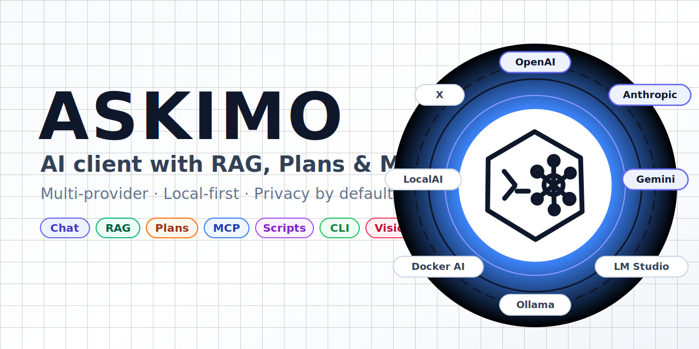
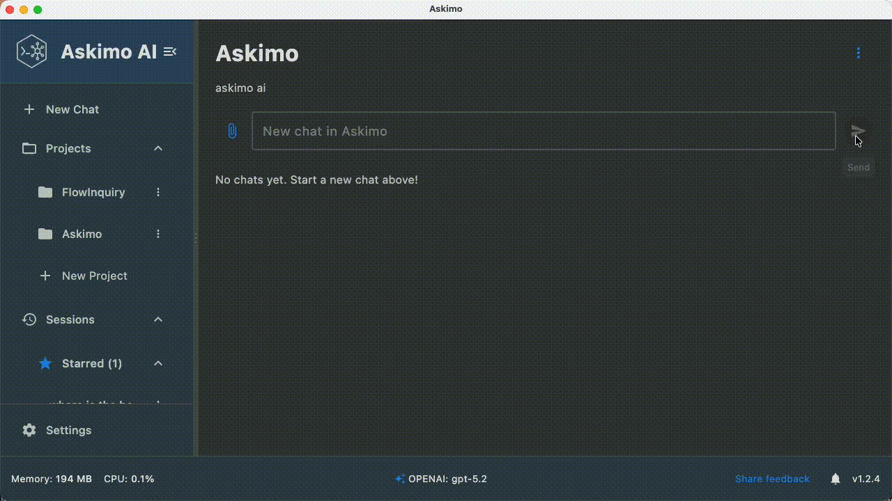
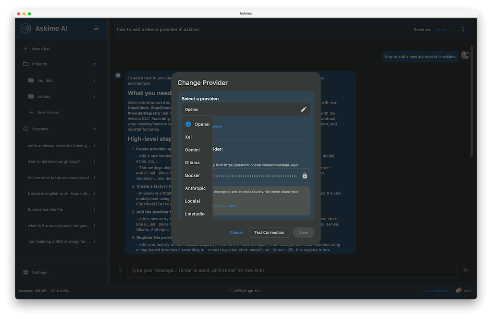
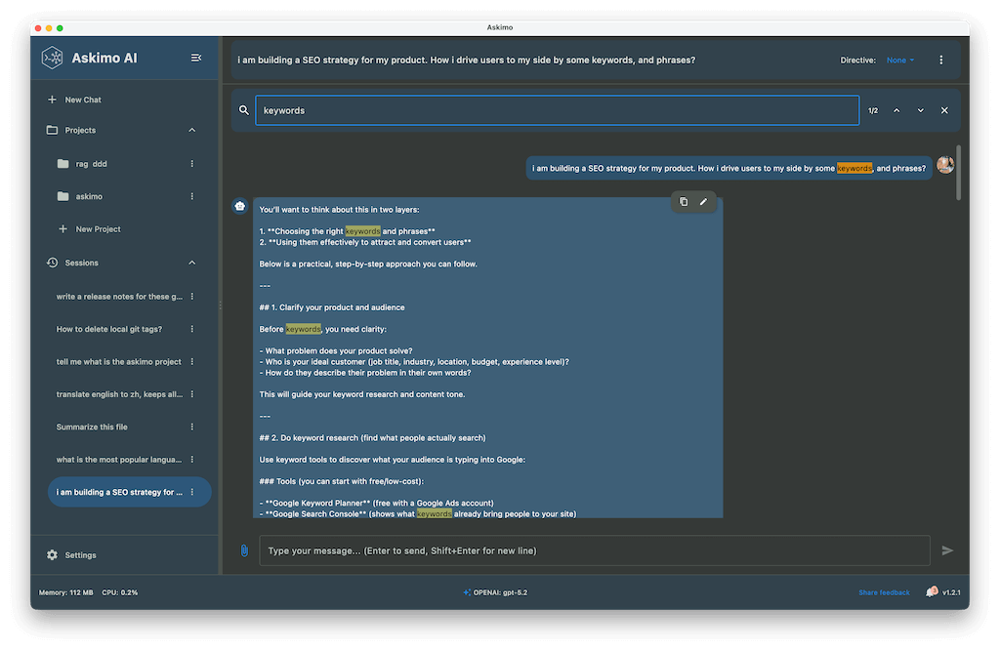
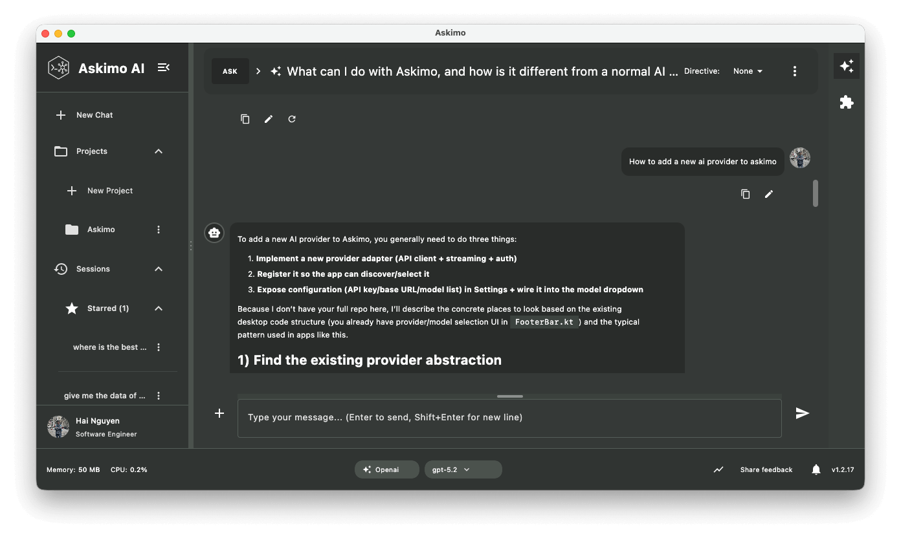

<p align="center">
  <picture>
    <source media="(prefers-color-scheme: dark)" srcset="public/github-logo-dark.svg">
    
  </picture>
</p>

<p align="center">
  <b><a href="https://askimo.chat">askimo.chat</a></b> · The AI chat client that works with ANY model.
</p>

<p align="center">
  <a href="https://github.com/haiphucnguyen/askimo/actions/workflows/cli-release.yml">
    
  </a>
  <a href="https://github.com/haiphucnguyen/askimo/actions/workflows/desktop-release.yml">
    
  </a>
  <a href="./LICENSE">
    
  </a>
  <a href="https://github.com/haiphucnguyen/askimo/releases">
    
  </a>
  <a href="./CONTRIBUTING.md#-enforcing-dco">
    
  </a>
</p>

<p align="center">
  <a href="https://github.com/haiphucnguyen/askimo/stargazers">
    
  </a>
  
  
  
  
  
</p>

<p align="center">
  
  
  
  
  
  
  
</p>

<p align="center">
  <a href="https://github.com/haiphucnguyen/askimo/releases/latest"><strong>📥 Download</strong></a> •
  <a href="https://askimo.chat/docs/"><strong>📖 Documentation</strong></a> •
  <a href="https://github.com/haiphucnguyen/askimo/discussions"><strong>💬 Discussions</strong></a> •
  <a href="https://github.com/haiphucnguyen/askimo/stargazers"><strong>⭐ Star on GitHub</strong></a>
</p>

---

## 🚀 What is Askimo?

**Askimo is your personal AI assistant that works on your computer - not in your browser.** Chat with different AI models (like ChatGPT, Claude, or Gemini) all in one place, without worrying about losing your conversations when you close a tab.

Think of it as having multiple AI assistants in one app: use Claude for coding, ChatGPT for conversation, and a free local model for quick emails. Everything is saved on your machine - no cloud storage required.

---

## Why Choose Askimo?

**All your AI assistants in one place.** Askimo gives you the freedom to work with any AI model you want.

✅ **Use multiple AI models** - Switch between ChatGPT, Claude, Gemini, Ollama & more  
✅ **Ask questions about your files** - Connect folders, files, and web URLs to get answers from your documents  
✅ **Automate tasks** - Works from command line for scripts and workflows  
✅ **Your data stays private** - Everything saved on your computer  
✅ **Free & open source** - Free forever with full source code access

---

## Supported Providers

**Cloud:** OpenAI · Claude · Gemini · Grok  
**Local:** Ollama · LM Studio · LocalAI · Docker AI

*Works with any OpenAI-compatible endpoint.*

## 🚀 Quick Start

**[Download Askimo for your operating system →](https://askimo.chat/download/)**

Installers available for macOS (Apple Silicon & Intel), Windows, and Linux (ARM64 & x64).

**After installation:** Open Askimo, add your API keys (or connect to Ollama for local models), and start chatting. [**Setup guide →**](https://askimo.chat/docs/desktop/ai-providers/)

### System Requirements

- **Memory**: 50-300 MB for Askimo itself (AI models require additional memory)
- **Operating System**: 
  - macOS 11.0 (Big Sur) or later
  - Windows 10 or later
  - Linux (Ubuntu 20.04+, Debian 11+, Fedora 35+, or compatible)
- **Disk Space**: 250 MB for application

---

[](https://askimo.chat/app/)

### 🎯 What You Get

- 🖥️ **Never Lose Your Conversations** - Your chats stay open even after closing the app or restarting your computer. No more "lost tab" frustration
- 🔄 **Use the Best AI for Each Task** - Need help with code? Use Claude. General questions? Try ChatGPT. Writing a quick email? Use a free local model. Switch instantly between different AIs
- 🔒 **Complete Privacy** - Everything stays on your computer. Your conversations, your data, your control. Nothing is sent to the cloud unless you choose to ask an AI
- 🧠 **Ask Questions About Your Files** - Point Askimo to folders, files, or web URLs and ask "What does this project do?" or "How does the login work?" Get answers from your actual documents and code
- 🔌 **Connect Custom Tools (Experimental)** - Extend AI capabilities with custom MCP (Model Context Protocol) integrations. Connect your own tools and services for specialized workflows
- ⭐ **Stay Organized** - Star your favorite conversations, search through everything you've ever asked, and keep work separate from personal chats
- 📊 **Beautiful Formatting** - See code with syntax highlighting, tables, diagrams, and properly formatted text. Copy and paste ready to use
- 🎯 **Save Your Favorite Prompts** - Create reusable templates for things you ask often. One click to use your "proofreader" or "code reviewer" assistant
- ⚡ **Work Fast** - Keyboard shortcuts for everything. Create new chats, switch AIs, and search without touching your mouse
- 📈 **Track Your Usage** - See how much you're using each AI model and what it costs. All displayed in easy-to-read charts
- 💾 **Export Everything** - Download your conversations as documents. Share insights or keep backups however you want


**Screenshots:**

<p align="center">
  
  
  
</p>

---

## ⚡ Command Line Tool (Optional)

**For advanced users:** Askimo also works from the command line, perfect for automating repetitive tasks.

```bash
# Analyze log files automatically
cat app.log | askimo -p "Find critical errors and suggest fixes"

# Get code review suggestions
git diff | askimo -p "Review this code for bugs and improvements"

# Use saved templates
askimo -r gitcommit
```

**Installation:**
```bash
# macOS/Linux
curl -sSL https://raw.githubusercontent.com/haiphucnguyen/askimo/main/tools/installation/install.sh | bash

# Windows (PowerShell)
iwr -useb https://raw.githubusercontent.com/haiphucnguyen/askimo/main/tools/installation/install.ps1 | iex
```

[**Learn more about the command line tool →**](https://askimo.chat/cli/)

---

## 🛠️ Developer Setup

Want to build and run Askimo from source? Here's how to get started:

### Prerequisites

- **JDK 21** or later
- **Git** for cloning the repository

### Clone & Build

```bash
# Clone the repository
git clone https://github.com/haiphucnguyen/askimo.git
cd askimo

# Run the desktop application
./gradlew :desktop:run

# Build native installers
./gradlew :desktop:package
```

### Project Structure

- **`desktop/`** - Desktop application (Kotlin Multiplatform)
- **`cli/`** - Command-line interface
- **`shared/`** - Shared business logic and utilities

### Contributing

Ready to contribute? Check out our [**Contributing Guide**](./CONTRIBUTING.md) for detailed development guidelines, code standards, and how to submit pull requests.

> **📚 Note:** For detailed information on customizing Askimo, building from source, and development workflows, follow the [**Development Getting Started Guide**](https://askimo.chat/docs/development/getting-started/).

---

## 🌐 Available in Your Language

Askimo speaks your language! The entire app interface is available in:

🇺🇸 English • 🇨🇳 Chinese (Simplified & Traditional) • 🇯🇵 Japanese • 🇰🇷 Korean • 🇫🇷 French • 🇪🇸 Spanish • 🇩🇪 German • 🇧🇷 Portuguese • 🇻🇳 Vietnamese

More languages coming soon. Want to help translate? [Let us know!](https://github.com/haiphucnguyen/askimo/discussions)

---

## 🤝 Need Help or Want to Contribute?

### Get Help

- 📖 **[User Guide](https://askimo.chat/docs/)** - Step-by-step instructions and tips
- 💬 **[Community Forum](https://github.com/haiphucnguyen/askimo/discussions)** - Ask questions, share your experience, get help from other users
- 🐛 **[Report a Problem](https://github.com/haiphucnguyen/askimo/issues)** - Something not working? Let us know
- 📧 **Email Us** - Need private help? Contact support@askimo.chat

### Ways to Contribute

We'd love your help making Askimo better! Here are some easy ways to get involved:

- ⭐ **Star the repo** - A quick click at the top helps others discover Askimo
- 🐛 **Report bugs** - Found something broken? [Tell us about it](https://github.com/haiphucnguyen/askimo/issues/new?template=bug_report.md)
- 💡 **Share ideas** - Have a suggestion? [We want to hear it](https://github.com/haiphucnguyen/askimo/issues/new?template=feature_request.md)
- 🌍 **Help translate** - Know another language? Help make Askimo available to more people
- 💻 **Contribute code** - Comfortable with coding? Check our [Contributing Guide](./CONTRIBUTING.md)
- 📝 **Improve documentation** - Spot a typo or confusing explanation? Fix it!

No contribution is too small - we appreciate all help! 🙌

---

## ❤️ Enjoying Askimo?

If you find Askimo helpful, here are a few simple ways to show support:

* **Star the repo** - A quick ⭐️ at the top helps a lot and keeps the project growing.

* **Contribute** - Spot a bug or want to improve something? Pull requests are always welcome.

* **Share feedback** - Got ideas or suggestions? Feel free to open an issue or start a discussion.

Thanks for being part of the journey! 🙌

---

## 📄 License

AGPLv3. See [LICENSE](./LICENSE).