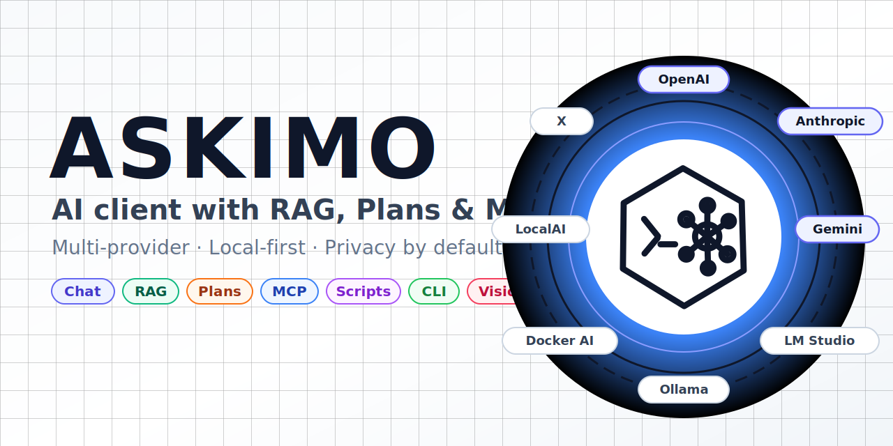
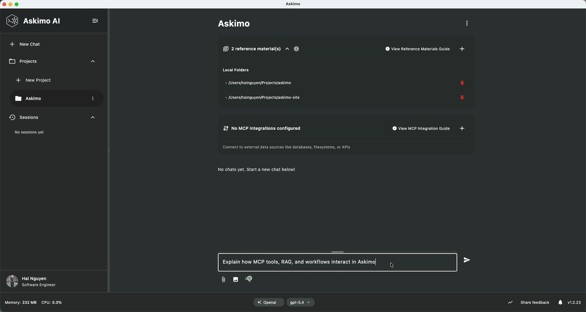
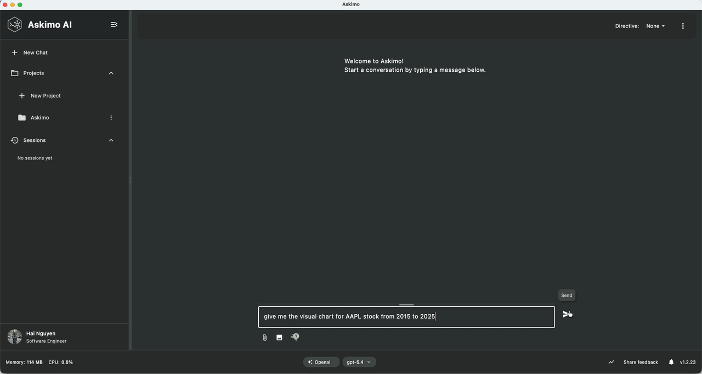
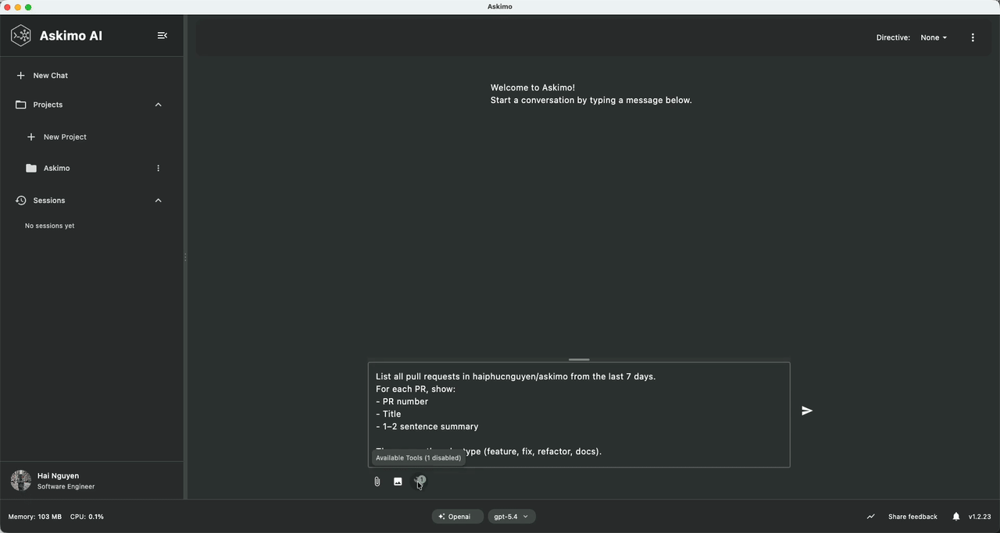
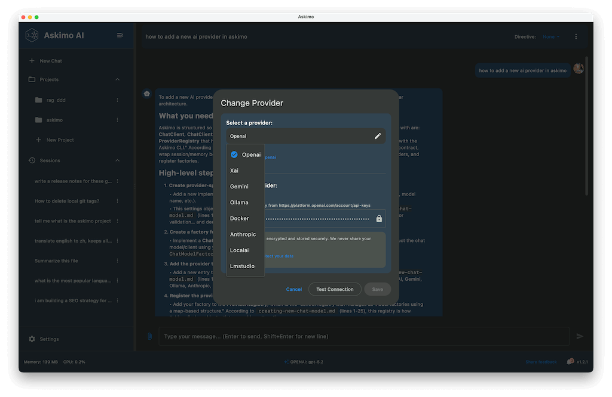
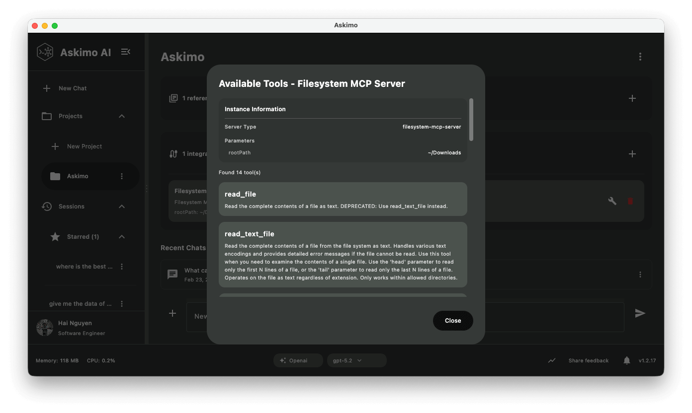
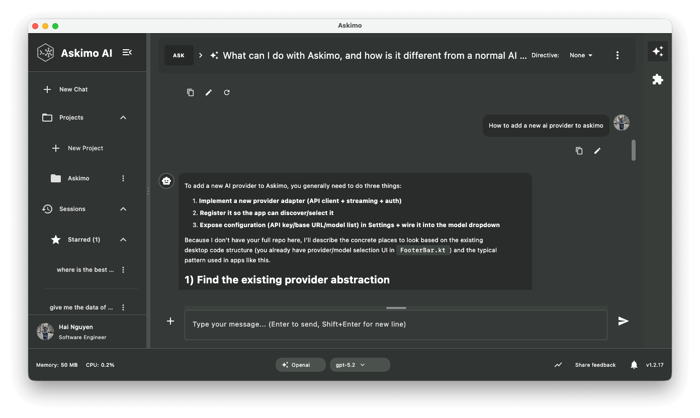

<p align="center">
  <picture>
    <source media="(prefers-color-scheme: dark)" srcset="public/github-logo-dark.svg">
    
  </picture>
</p>

<p align="center">
  <b><a href="https://askimo.chat">askimo.chat</a></b> · Local-first AI agent platform: chat, search, run, plan.
</p>

<p align="center">
  <a href="https://github.com/haiphucnguyen/askimo/actions/workflows/cli-release.yml">
    
  </a>
  <a href="https://github.com/haiphucnguyen/askimo/actions/workflows/desktop-release.yml">
    
  </a>
  <a href="./LICENSE">
    
  </a>
  <a href="https://github.com/haiphucnguyen/askimo/releases">
    
  </a>
  <a href="./CONTRIBUTING.md#-enforcing-dco">
    
  </a>
</p>

<p align="center">
  <a href="https://github.com/haiphucnguyen/askimo/stargazers">
    
  </a>
  
  
  
  
  
</p>

<p align="center">
  
  
  
  
  
  
  
  
</p>

<p align="center">
  <a href="https://github.com/haiphucnguyen/askimo/releases/latest"><strong>📥 Download</strong></a> •
  <a href="https://askimo.chat/docs/"><strong>📖 Documentation</strong></a> •
  <a href="https://github.com/haiphucnguyen/askimo/discussions"><strong>💬 Discussions</strong></a> •
  <a href="https://github.com/haiphucnguyen/askimo/stargazers"><strong>⭐ Star on GitHub</strong></a>
</p>

---

## What is Askimo?

Askimo is a local-first AI desktop app and CLI. It connects AI models to your local files, tools, and workflows - without routing data through a cloud service.

It supports multiple providers (OpenAI, Claude, Gemini, Ollama, and others), persistent chat sessions backed by SQLite, document and code search via hybrid RAG (BM25 + vector), MCP tool integration, a script runner for Python/Bash/JavaScript, and a **Plans engine** that chains multi-step AI workflows into a single click. All state lives on your disk.

---

## Features

- **Multi-provider** - Configure and switch between cloud and local AI providers per session. Supported: OpenAI, Anthropic, Google Gemini, xAI Grok, Ollama, LM Studio, LocalAI, Docker AI, and any OpenAI-compatible endpoint
- **Persistent sessions** - Conversations are stored in a local SQLite database and restored on restart
- **RAG** - Index local folders, files, and web URLs. Uses hybrid BM25 + vector retrieval with an AI-based classifier that skips retrieval when the query doesn't need it
- **Plans (agentic workflows)** - Run multi-step AI pipelines from a form-based UI. Each step builds on the previous one; progress is shown live. Export results as PDF or Word. Define your own plans in YAML
- **Script runner** - Execute Python, Bash, and JavaScript directly from chat. Python scripts run in an auto-managed virtualenv with automatic dependency installation
- **Vision** - Attach images to conversations; works with any multimodal model
- **MCP tool integration** - Connect MCP-compatible servers via stdio or HTTP, scoped globally or per project
- **Recipe automation (CLI)** - Define prompt templates in YAML with variables, file I/O, and post-actions. Run with `askimo -r <recipe> [args]`
- **Local telemetry** - Tracks token usage, estimated cost, and RAG performance per provider. Nothing is uploaded
- **i18n** - UI available in English, Chinese (Simplified and Traditional), Japanese, Korean, French, Spanish, German, Portuguese, and Vietnamese

---

## Plans - Multi-Step AI Workflows

A single AI prompt cannot reason properly across multiple stages. When you ask one prompt to research, analyse, and conclude all at once, the AI skips the dependencies between those stages and produces output that sounds thorough but could apply to almost anything.

Plans mirror how experts actually think. Each step has one focused job and one persona - researcher, analyst, strategist, writer. The output of each step feeds automatically into the next as grounded context. No copy-pasting. No re-prompting. The chain runs end-to-end and the final result reflects genuine staged reasoning: specific, traceable, and defensible.

Fill in a form. Askimo handles the rest.

**Built-in plans:**

| Plan | What it does |
|---|---|
| 💼 Job Application Writer | Analyses a job description, matches your CV, writes a tailored cover letter, and produces an ATS-optimised resume |
| ✍️ Blog Post Writer | Generates an outline, writes the full draft, adds SEO metadata, and outputs the polished final post |
| 🏆 Competitor Analysis | Profiles a competitor, compares against your product, and produces a strategic opportunities report |
| 📋 Meeting Notes Processor | Structures raw notes, extracts action items with owners, and produces shareable meeting minutes |
| 📝 Research Report | Researches a topic and writes a structured report with executive summary and key findings |
| 📧 Email Writer | Drafts and self-refines a professional email from a one-line description |

**Key capabilities:**
- Live step-by-step progress with per-step timing
- Export any result as **PDF** or **Word (.docx)**
- **Create your own plans with AI** - describe your workflow in plain English and the AI generates valid plan YAML instantly; no manual YAML writing required
- Fine-tune generated plans in the built-in YAML editor, or duplicate any built-in plan as a starting point

---

## Supported Providers

**Cloud:** OpenAI · Anthropic Claude · Google Gemini · xAI Grok  
**Local:** Ollama · LM Studio · LocalAI · Docker AI

Works with any OpenAI-compatible endpoint via custom base URL.

---

## Quick Start

**[Download for macOS, Windows, or Linux →](https://askimo.chat/download/)**

After installation, open Askimo, configure a provider (API key for cloud models, or point it at a running Ollama instance), and start a session. [Setup guide →](https://askimo.chat/docs/desktop/ai-providers/)

### System Requirements

| | |
|---|---|
| **OS** | macOS 11+, Windows 10+, Linux (Ubuntu 20.04+, Debian 11+, Fedora 35+) |
| **Memory** | 50–300 MB (AI models require additional memory depending on provider) |
| **Disk** | 250 MB |

---

## Screenshots and Demos

**Plan:**

[](public/askimo_plan_1920.gif)

**RAG:**

[](public/askimo_rag_1920.gif)

**Script runner:**

[](public/askimo_run_script_1920.gif)

**MCP tools:**

[](public/askimo_mcp_1920.gif)

<p align="center">
  
  
  
</p>

---

## CLI (Optional)

Askimo also ships as a native CLI binary built with GraalVM. Useful for scripting, automation, and headless environments.

```bash
# macOS/Linux
curl -sSL https://raw.githubusercontent.com/haiphucnguyen/askimo/main/tools/installation/install.sh | bash

# Windows (PowerShell)
iwr -useb https://raw.githubusercontent.com/haiphucnguyen/askimo/main/tools/installation/install.ps1 | iex
```

[CLI documentation →](https://askimo.chat/cli/)

---

## Building from Source

### Prerequisites

- JDK 21+
- Git

### Build

```bash
git clone https://github.com/haiphucnguyen/askimo.git
cd askimo

# Run the desktop app
./gradlew :desktop:run

# Build native installers
./gradlew :desktop:package

# Build CLI native binary (requires GraalVM)
./gradlew :cli:nativeCompile
```

### Project Structure

- **`desktop/`** - Compose Multiplatform desktop application
- **`desktop-shared/`** - Shared UI components usable across products
- **`cli/`** - JLine3 REPL and GraalVM native image
- **`shared/`** - Core logic: providers, RAG, MCP, memory, tools, database, plans engine

See [CONTRIBUTING.md](./CONTRIBUTING.md) for development guidelines, code style, and DCO requirements.

> For full developer documentation, see the [Development Getting Started Guide](https://askimo.chat/docs/development/getting-started/).

---

## Localization

UI is available in: English, Chinese (Simplified and Traditional), Japanese, Korean, French, Spanish, German, Portuguese, Vietnamese.

Want to add a language? [Open a discussion](https://github.com/haiphucnguyen/askimo/discussions).

---

## Getting Help

- [Documentation](https://askimo.chat/docs/)
- [GitHub Discussions](https://github.com/haiphucnguyen/askimo/discussions)
- [Issue Tracker](https://github.com/haiphucnguyen/askimo/issues)

---

## Contributing

Bug reports, feature requests, and pull requests are welcome. See [CONTRIBUTING.md](./CONTRIBUTING.md) for details.

---

## License

AGPLv3. See [LICENSE](./LICENSE).