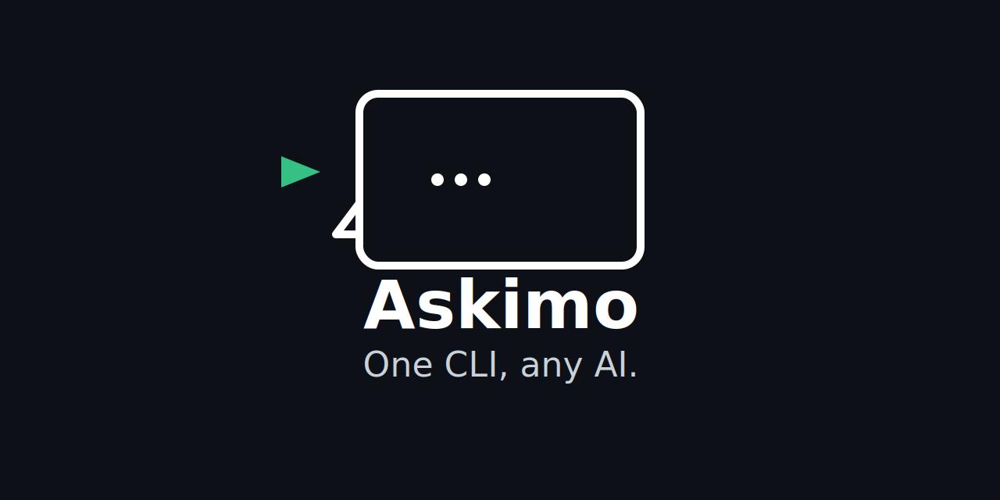

  <picture>
    <source media="(prefers-color-scheme: dark)" srcset="public/askimo-logo.svg">
    
  </picture>

  <b><a href="https://askimo.chat">askimo.chat</a></b> · AI Desktop + CLI toolkit that works with ANY model.

  
  
  
  
  
   

# Why Askimo?

Askimo is a provider-agnostic AI toolkit built for developers, writers, researchers, and anyone who wants full control over their AI experience.

* One desktop app for ALL AI providers

* CLI automation for logs, files, scripts, and pipelines

* Local-first: your chat history stays on your machine

* Lightning-fast provider switching

* Searchable chat history with favorites & exports

* Custom directives and prompt libraries

* RAG-enabled project workspaces (CLI)

* Extensible architecture for future tools

Askimo is both:

* A native desktop chat client, and

* A command-line automation tool

## Demo

### Askimo Desktop Chat

### Askimo CLI Workflows

## Supported Providers
### Cloud

* OpenAI

* Anthropic Claude

* Google Gemini

* X AI (Grok)

### Local

* Ollama

* LM Studio (coming)

* LocalAI (coming)

* llama.cpp Server (coming)

Askimo works with any OpenAI-compatible API endpoint.

## Askimo vs Other AI Clients

| Feature | **Askimo** | **LM Studio** | **Ollama Desktop GUIs** | **ChatGPT Desktop** |
|--------|-------------|----------------|--------------------------|----------------------|
| Works with multiple providers | ✅ | ❌ | ❌ | ❌ |
| Works with local models | ✅ | ✅ | ✅ | ❌ |
| Works with cloud models (OpenAI, Claude, Gemini, etc.) | ✅ | ❌ | ❌ | ❌ |
| Desktop application | ✅ | ✅ | Varies | ❌ |
| Command-line interface (CLI) | ✅ | ❌ | ❌ | ❌ |
| Automation / scripting support | ✅ | ❌ | ❌ | ❌ |
| RAG (Retrieval-Augmented Generation) | CLI only (Desktop coming) | ❌ | ❌ | ❌ |
| Searchable chat history | ✅ | ❌ | ❌ | ❌ |
| Star/favorite conversations | ✅ | ❌ | ❌ | ❌ |
| Custom directives / prompt profiles | ✅ | ❌ | ❌ | ❌ |
| Export conversations | ✅ | ❌ | Varies | ❌ |
| Privacy (local storage) | ✅ | Partial | Partial | ❌ |
| Multi-workspace organization | Coming | ❌ | ❌ | ❌ |
| Works offline (local models) | ✅ | ✅ | ✅ | ❌ |

## Askimo Products

### Askimo Desktop

A native application that brings all your AI conversations into one interface.  
Designed for writers, developers, researchers, and anyone who needs fast and consistent AI assistance.

#### Key Desktop Features
- Switch between OpenAI, Claude, Gemini, X AI, and Ollama instantly
- Persistent local chat history
- Markdown rendering, syntax highlighting, and image support
- Star and save important conversations
- Custom directives for shaping AI responses
- Smart search across your chat history
- Privacy by default, no cloud storage
- Prompt library and keyboard shortcuts

Get Askimo Desktop: https://askimo.chat/desktop

### Askimo CLI

A flexible AI automation tool built for terminal workflows, scripting, and development pipelines.

#### Key CLI Features
- Provider-agnostic commands
- Pipe logs, files, or command outputs directly into AI
- Reusable Recipes for automation
- Project workspaces with RAG indexing using PostgreSQL and pgvector
- Non-interactive mode for CI and automation
- Extensible provider and command architecture

Get Askimo CLI: https://askimo.chat/cli

## License

Apache 2.0. See [LICENSE](./LICENSE).
