# Stop Your RAG System From Searching Everything (Here's How I Fixed Mine)

I'm building [Askimo](https://github.com/haiphucnguyen/askimo) - an open-source AI chat application that lets you talk to multiple AI models (GPT-4, Claude, Gemini, local models) with RAG support. Think of it as ChatGPT, but you can index your own documents and projects for context-aware answers.

The problem? My RAG system was burning through API calls like crazy. It was searching my vector database for **every. single. message.** Even when users just said "thanks" or asked follow-up questions.

Here's what I was wasting:
- ⏱️ **Time** - Unnecessary vector searches adding 2-3 seconds per message
- 💰 **Money** - Embedding API calls that cost me ~$50/month for my own testing
- 🎯 **Accuracy** - Polluting the LLM with irrelevant documents, causing wrong answers

After weeks of debugging chat logs and profiling costs, I built an **AI-powered classifier** that decides when RAG is actually needed. The results?

- **67% fewer RAG retrievals** (from ~100/day to ~33/day in my testing)
- **44% faster responses** (vector search is slow!)
- **Better answers** (no more context pollution)

Let me show you exactly how I fixed this in Askimo.

## The Problem: Blind RAG is Expensive

Here's a typical RAG flow:

```
User: "Who is the lead developer?"
→ Vector search → Retrieve docs → LLM generates answer ✅

User: "Thanks!"
→ Vector search → Retrieve docs → LLM generates answer ❌ (Waste!)

User: "Can you explain more about their role?"
→ Vector search → Retrieve docs → LLM generates answer ❌ (Already has context!)
```

Let's visualize the difference:

```mermaid
sequenceDiagram
    participant User
    participant System
    participant RAG
    participant LLM
    
    Note over User,LLM: WITHOUT Classification (Blind RAG)
    User->>System: "Who is the founder?"
    System->>RAG: Retrieve ($$)
    RAG-->>System: Context docs
    System->>LLM: Generate with context
    LLM-->>User: Answer ✅
    
    User->>System: "Thanks!"
    System->>RAG: Retrieve ($$) ❌ Waste!
    RAG-->>System: Context docs
    System->>LLM: Generate with context
    LLM-->>User: "You're welcome!"
    
    Note over User,LLM: WITH Classification (Smart RAG)
    User->>System: "Who is the founder?"
    System->>System: Classify → YES
    System->>RAG: Retrieve ($$)
    RAG-->>System: Context docs
    System->>LLM: Generate with context
    LLM-->>User: Answer ✅
    
    User->>System: "Thanks!"
    System->>System: Classify → NO ✅
    System->>LLM: Generate (no retrieval)
    LLM-->>User: "You're welcome!"
```



See the problem? **Every single message** triggers an expensive search operation, even when it's completely unnecessary.

Think about how conversations actually work:
- Someone asks you a question
- You answer it
- They say "thanks" or "got it" or "makes sense"
- Or they ask a follow-up: "what about X?" or "can you explain that differently?"

None of those follow-ups need you to run back to the library. You already have the context in your head!

But most RAG systems don't think like that. They just... search. Always. For everything.

Here's where it gets worse than just expensive—**it actually breaks your answers**. 

Picture this real scenario I saw:

```
User: "How do I set up MongoDB in the project?"
AI: [Searches docs, finds setup guide] "Here's how to configure MongoDB..."

User: "What about PostgreSQL instead?"
AI: [Searches "What about PostgreSQL instead?"]
    → Finds random docs mentioning "what" and "PostgreSQL" and "instead"
    → Returns completely unrelated content about PostgreSQL migrations
    "PostgreSQL migrations work differently than MongoDB..."  ❌ WRONG!
```

The user wanted to know how to set up PostgreSQL **the same way** we just explained MongoDB. But the RAG system searched for their exact words "What about PostgreSQL instead?" and returned garbage. The AI got confused and gave a nonsense answer.

**This is the real problem.** Not just wasted money—actual wrong answers because your retriever is searching for follow-up phrases that make no sense out of context.

I watched one conversation rack up **12 RAG retrievals**. The user asked one real question, then spent 10 follow-ups saying things like "what about X?" and "can you show another example?" Each search polluted the context with irrelevant documents, making the answers progressively worse.

## The Solution: AI-Powered Intent Classification

Instead of always retrieving, we ask a *fast, cheap LLM* to classify:

> **"Does this message need knowledge base lookup?"**

Here's the architecture:

```kotlin
class RAGContentProcessor(
    private val delegate: ContentRetriever,      // Your actual RAG retriever
    private val classifierChatClient: ChatClient // Fast/cheap LLM for classification
) : ContentRetriever {
    
    override fun retrieve(query: Query): List<Content> {
        val shouldUseRAG = classifier.shouldUseRAG(
            userMessage = query.text(),
            conversationHistory = query.metadata().chatMemory()
        )
        
        return if (shouldUseRAG) {
            delegate.retrieve(query)  // Do expensive RAG
        } else {
            emptyList()                // Skip retrieval
        }
    }
}
```

**Decorator Pattern FTW!** We wrap any `ContentRetriever` and add intelligent gating.

## The Classifier: Prompt Engineering is Key

The magic is in the prompt. Here's what works:

```kotlin
fun buildClassificationPrompt(userMessage: String, history: List<ChatMessage>): String {
    val recentContext = history.takeLast(3).joinToString("\n") { 
        "${it.role}: ${it.text.take(150)}..." 
    }
    
    return """
        Does this user message need to search the knowledge base (RAG)?
        
        Recent conversation:
        $recentContext
        
        Current message: "$userMessage"
        
        Respond ONLY with "YES" or "NO":
        
        YES - If the message is:
        - A NEW question requiring knowledge base lookup
        - Asking "who", "what", "where" about specific entities or concepts
        - Asking "how to" do something
        - Requesting code examples or documentation
        - Looking up API/library/feature information
        - Any factual query that might be in the knowledge base
        
        NO - If the message is:
        - A follow-up clarification ("explain more", "what about X?")
        - Correcting or critiquing the AI's previous answer
        - Casual conversation ("yes", "no", "thanks", "ok")
        - Requesting modification of the previous response
        - Discussing something already covered in recent messages
        
        Answer:
    """.trimIndent()
}
```

### Why This Works

1. **Context-Aware**: We pass the last 3 messages so the classifier knows if this is a follow-up
2. **Clear Examples**: Specific examples help the LLM understand edge cases
3. **Simple Output**: Just "YES" or "NO" - easy to parse
4. **Language-Agnostic**: Works in Spanish, German, etc. (the LLM handles it)

## Real-World Results

Here's what happens in practice:

### ✅ Correctly Triggers RAG

```
User: "Who is Hai Nguyen?"
Classifier: YES → Searches knowledge base → Finds bio
```

```
User: "How do I configure the API key?"
Classifier: YES → Searches docs → Returns setup guide
```

### ✅ Correctly Skips RAG

```
User: "Thanks, that helps!"
Classifier: NO → Skips search → Direct response
```

```
User: "Can you explain that differently?"
Classifier: NO → Skips search → Rephrases previous answer
```

```
User: "Actually, I meant the other file"
Classifier: NO → Skips search → Clarifies from context
```

## Implementation Details

### 1. Use a Fast, Cheap Model

For classification, you don't need GPT-4. We use:

- **OpenAI**: `gpt-3.5-turbo` (fast, $0.0005/1K tokens)
- **Anthropic**: `claude-3-haiku` (fast, $0.00025/1K tokens)
- **Local**: Same model (no extra cost!)

```kotlin
// For cloud providers, use a cheap model
val classifierClient = when (provider) {
    OPENAI -> createClient(model = "gpt-3.5-turbo")
    ANTHROPIC -> createClient(model = "claude-3-haiku")
    OLLAMA -> createClient(model = currentModel) // Free!
}
```

### 2. Add Timeout Protection

Classification should be fast. If it takes >5 seconds, something's wrong:

```kotlin
suspend fun shouldUseRAG(
    userMessage: String,
    conversationHistory: List<ChatMessage>
): Boolean = try {
    withTimeout(5000L) {
        val response = classifierClient.sendMessage(prompt)
        response.trim().uppercase() == "YES"
    }
} catch (e: Exception) {
    log.warn("Classification failed: ${e.message}. Defaulting to RAG")
    true  // Fail open - better to retrieve than miss
}
```

**Fail-safe**: If classification fails, default to *using* RAG. Better safe than sorry.

### 3. Keep the Classifier Simple

Here's a key insight: **Don't send the full chat memory to the classifier.**

In Askimo, we only pass the last few user/assistant messages as plain text - no system messages, no complex memory objects:

```kotlin
// Extract just the conversation context you need
val recentMessages = conversationHistory
    .takeLast(3)
    .filterNot { it is SystemMessage }
    .joinToString("\n") { "${it.role}: ${it.text}" }

// Build a simple prompt with just the essentials
val prompt = buildClassificationPrompt(
    userMessage = query.text(),
    recentContext = recentMessages  // Just a string!
)
```

**Why this is better:**

1. **No pollution** - System messages contain instructions like "You are a helpful assistant..." that confuse the classifier
2. **Faster** - Fewer tokens = faster classification = lower cost
3. **Clearer** - The classifier only sees what it needs: recent conversation flow
4. **Simpler** - No need to parse complex memory structures

The classifier doesn't need to know your system instructions or memory summaries. It just needs to see: "Did the user ask something new, or are they following up on what we just discussed?"

## Bonus: Hybrid Search with RRF

Once you *do* retrieve, make it count! We use **Reciprocal Rank Fusion** to combine:

- 🔍 **Vector search** (semantic similarity)
- 📝 **Keyword search** (BM25/Lucene)

```kotlin
class HybridContentRetriever(
    private val vectorRetriever: ContentRetriever,
    private val keywordRetriever: ContentRetriever,
    private val k: Int = 60  // RRF constant
) : ContentRetriever {
    
    override fun retrieve(query: Query): List<Content> {
        val vectorResults = vectorRetriever.retrieve(query)
        val keywordResults = keywordRetriever.retrieve(query)
        
        return reciprocalRankFusion(vectorResults, keywordResults)
    }
    
    private fun reciprocalRankFusion(
        vectorResults: List<Content>,
        keywordResults: List<Content>
    ): List<Content> {
        val scoreMap = mutableMapOf<String, Double>()
        
        vectorResults.forEachIndexed { index, content ->
            val key = content.text()
            scoreMap[key] = scoreMap.getOrDefault(key, 0.0) + 1.0 / (k + index + 1)
        }
        
        keywordResults.forEachIndexed { index, content ->
            val key = content.text()
            scoreMap[key] = scoreMap.getOrDefault(key, 0.0) + 1.0 / (k + index + 1)
        }
        
        return scoreMap.entries
            .sortedByDescending { it.value }
            .map { /* reconstruct Content */ }
    }
}
```

**Why RRF?**
- Catches exact matches (keywords) that vectors might miss
- Leverages semantic understanding (vectors) for fuzzy queries
- Robust if one retriever fails

## Common Pitfalls to Avoid

### ❌ Don't Use an Expensive Model for Classification

Look, classification is basically a YES/NO question. You don't need GPT-4 or Claude Opus burning $0.03 per 1K tokens when GPT-3.5 or Claude Haiku does it for $0.0005 per 1K tokens.

**Do the math:**
- 1000 classifications with GPT-4: **$30**
- 1000 classifications with GPT-3.5: **$0.50**

That's a **60x difference** for a task that doesn't need fancy reasoning. Save your expensive models for the actual answering where quality matters.

Plus, cheaper models are usually **faster**. GPT-3.5 responds in ~500ms vs GPT-4's ~2 seconds. Your users will notice.

### ❌ Don't Over-Engineer

You don't need ML models, embeddings, or complex rules. A simple LLM prompt works great.

### ❌ Don't Forget Context

Always pass recent conversation history. Without it, the classifier can't distinguish new questions from follow-ups.

### ❌ Don't Block on Classification

Use `suspend` functions or async to avoid blocking your main thread.

## The Full Flow

Here's how it all fits together:


## Try It Yourself

Want to see this in action? Check out [Askimo](https://github.com/haiphucnguyen/askimo) - it's open source!

The key files:
- [`RAGIntentClassifier.kt`](https://github.com/haiphucnguyen/askimo/blob/main/shared/src/main/kotlin/io/askimo/core/rag/RAGIntentClassifier.kt) - AI classification logic
- [`RAGContentProcessor.kt`](https://github.com/haiphucnguyen/askimo/blob/main/shared/src/main/kotlin/io/askimo/core/rag/RAGContentProcessor.kt) - Decorator pattern wrapper
- [`HybridContentRetriever.kt`](https://github.com/haiphucnguyen/askimo/blob/main/shared/src/main/kotlin/io/askimo/core/rag/HybridContentRetriever.kt) - RRF implementation

## Key Takeaways

Here's what I learned building this:

1. **Stop searching everything** - Seriously, your users say "thanks" and "can you explain that again?" way more than they ask new questions. Don't waste money retrieving documents for casual chit-chat.

2. **A cheap LLM is all you need** - You don't need fancy ML models or complex rules. GPT-3.5 or Claude Haiku costs pennies and does the job perfectly. They're fast enough that users won't even notice.

3. **Context is everything** - Without passing recent conversation history, your classifier thinks every "what about X?" is a brand new question. Give it the last few messages and it suddenly gets way smarter.

4. **When in doubt, search anyway** - If your classifier times out or errors, just do the RAG retrieval. It's better to waste one search than miss answering a real question. Fail-safe, not fail-closed.

5. **Mix it up** - Vector search is great for "explain database indexing" but terrible for exact matches like "MongoDB connection string". Keyword search is the opposite. Combine both with RRF and you get the best of both worlds.

---

*If you found this helpful, give it a ❤️ and follow for more RAG/AI content!*

*GitHub: [github.com/haiphucnguyen/askimo](https://github.com/haiphucnguyen/askimo)*

